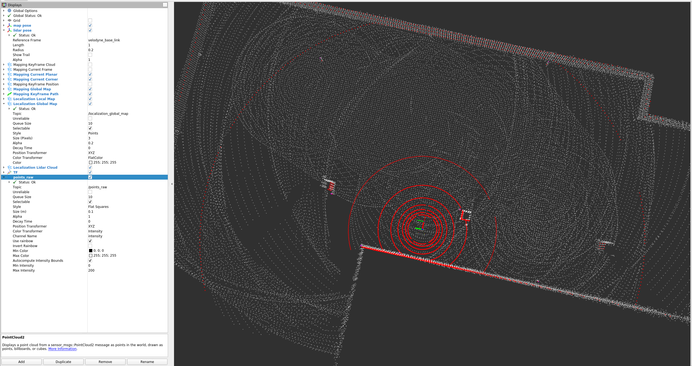

- 基线版本（master）：所有基础功能的实现和高度的稳定性。
- 里程碑（tag）：所有定制版本需基于master分支上的tag开发，所有定制版本的基础功能和核心代码的bug修复必须回归至master分支。
- 定制版本（xxx_dev）：`xxx`为具体项目名称，如`国网`项目分支名应设为`guowang_dev`。
- 开发版本 (develop): 当前开发的稳定版本
- 开发者分支 (xxx_dev):`xxx`为人名,如`kimi`分支为`kimi_dev`。

# 后续使用方式
1. 将 config 文件夹放到home目录下;  
2. 解压ts_robot.zip 后可以直接source ts_robot/setup.bash 后启动launch
3. src/example 下是example示例源文件
# 驱动
## 依赖
```
sudo apt-get install ros-noetic-filters
sudo apt-get install libmuparser-dev
```
## 启动can  
开机要使能can，确保can处于可用状态
```
roslaunch socketcan_bridge socketcan_bridge.launch
```
接收：sent_messages  
发布：received_messages
## 启动底盘
```
roslaunch walk_motor_driver walk_motor_driver.launch
```
## demo01 运动仿真
### 主要接口
### 📡 主要接口
**订阅话题：**
- `/vehicle_cmd` - 车辆控制命令

**发布话题：**
- `/odom` - 里程计信息
### 🚀 启动命令
```
roslaunch agv_description dual_sim_control.launch  
rosrun agv_sim_control dual_servo_commands.py  
roslaunch vehicle_kinematics dual_kinematics.launch  
roslaunch vehicle_kinematics test_cmd.launch  
```


## demo02 导航节点测试
### 🚀 启动命令
```
roslaunch example example_02.launch
roslaunch amr_navigation amr_navigation.launch  
roslaunch example action_cilent_test.launch
```

## demo03 任务决策节点测试
### 🚀 启动命令
```
roslaunch example example_03.launch
roslaunch decision_maker decision_maker.launch 
```

## demo04 UDP接口测试
### 🚀 启动命令
```
roslaunch example example_api_udp.launch 
```

## demo05 建图和定位
### 🚀 建图启动命令
```
roslaunch example example_mapping.launch

roslaunch funny_lidar_slam mapping_lio_sam.launch
# 控制车移动
roslaunch agv_sim_control key_cmd.launch
```
### 🚀 保存地图
```
rosservice call /funny_lidar_slam/save_map "map_path: ''
split_map: false" # 保存地图到funny_lidar_slam包的data下
```
### 🚀 定位
效果图

```
roslaunch example example_mapping.launch

roslaunch funny_lidar_slam localization_turing.launch
# 控制车移动
roslaunch agv_sim_control key_cmd.launch
```

wls仿真环境中遇到gazebo启动失败问题 `export LIBGL_ALWAYS_SOFTWARE=1`
